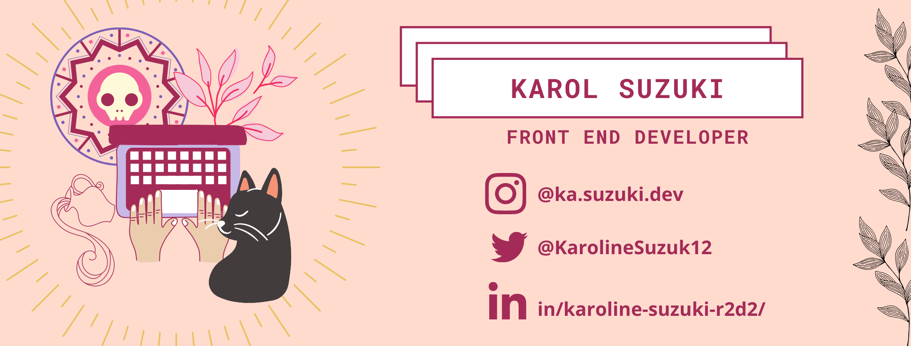

## 👋 Hi! Prazer, Karol Suzuki

### :computer: Atualmente sou desenvolvedora front, atuando com Angular, mas tenho conhecimentos em React Redux ou Hooks tbm!

### :books: A finalidade maior do repositório, é pra fins de estudo, mas fique a vontade pra ver, dar star, e forkar o que você achar legal 

### :blush: E também faço parte da organizaçõa do Nerdzão, uma comunidade de tecnologia de São Paulo, e o Nerdgirlz, que é uma frente feminina desta comunidade. 
### :laughing: Nos sigam nas redes, @onerdzao !

<td>

<!--
**suzukikarol/suzukikarol** is a ✨ _special_ ✨ repository because its `README.md` (this file) appears on your GitHub profile.

Here are some ideas to get you started:

- 🔭 I’m currently working on ...
- 🌱 I’m currently learning ...
- 👯 I’m looking to collaborate on ...
- 🤔 I’m looking for help with ...
- 💬 Ask me about ...
- 📫 How to reach me: ...
- 😄 Pronouns: ...
- ⚡ Fun fact: ...
-->
